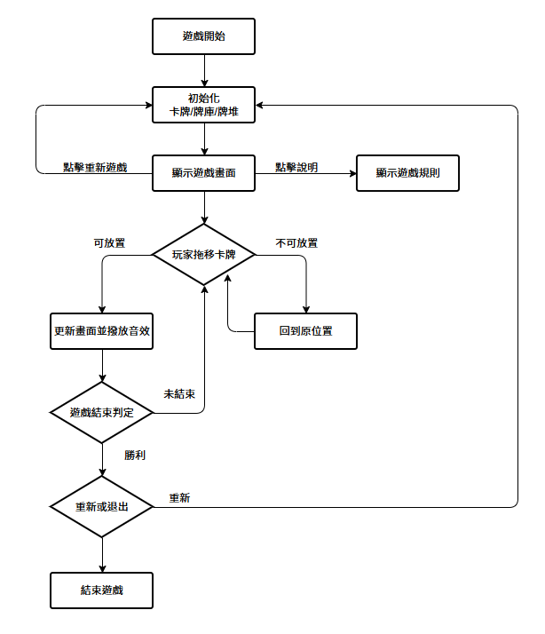
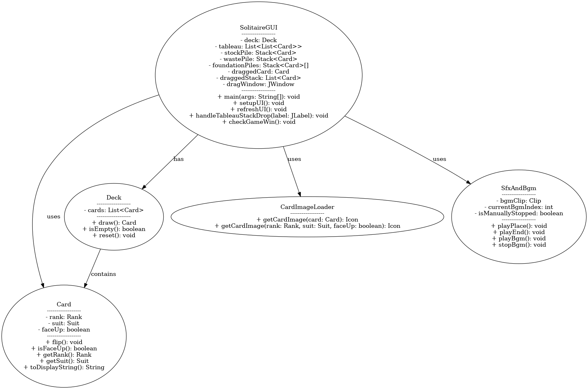
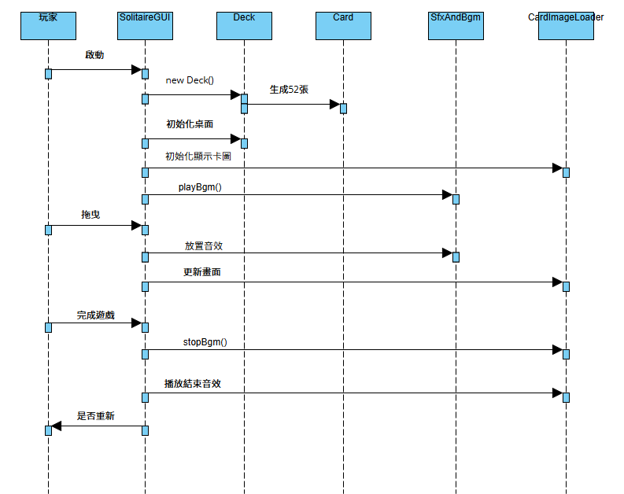

# 2025 JAVA 實習 單人接龍
- 學號：B11107160 姓名：黃正亮  
學號：B11130028 姓名：李哲
- 分工說明：  
  - 黃正亮：  
    - 遊戲UI
    - 遊戲基本遊玩規則
    - 影片說明及報告
  - 李哲：  
    - 音樂音效檔下載
    - 音樂音效播放類別製作
    - 拖移動畫
- [報告影片連結]()
## 遊戲說明
- 不同顏色的卡牌才能互疊，數字小的疊在數字打的上方  
- 牌堆中的空格可以放置 K  
- 4個方格依花色由 A 排至 K ，全部排完則勝利！
### 操作說明
- 牌庫點擊左右鍵可以翻牌  
- 按著撲克牌移動可以拖移

## 執行檔說明
直接執行Project資料夾中的接龍.jar即可

# 流程圖

# UML類別圖

# 時序圖

